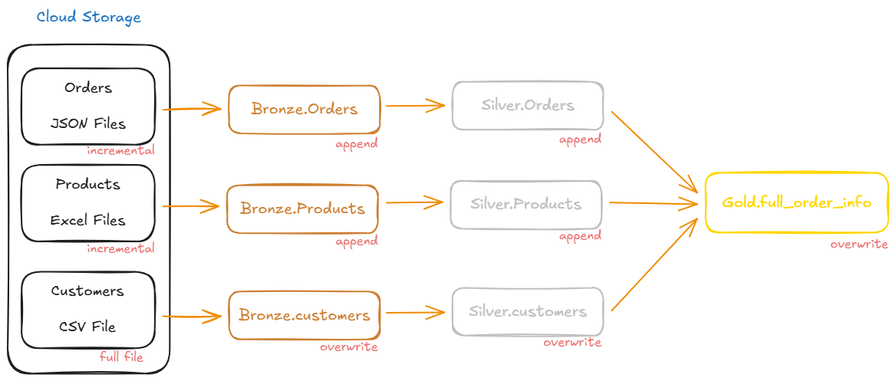

# Databricks E-commerce Sales Data Pipeline
This project implements a production-grade data engineering solution on **Azure Databricks** to process, enrich, and aggregate e-commerce sales data. The system ingests raw datasets related to customers, products, orders, and transactions, transforms them into analytics-ready tables, and exposes business-level aggregates for downstream reporting and decision-making. The solution emphasizes scalability, data quality, testability, and clear architectural separation of concerns.

**Full Problem Statement:** https://github.com/faraaznx/databricks-ecommerce-project/tree/main/Problem_Statement

## Assumptions

The following assumptions were deliberately made to model the solution as a production-grade data pipeline and to represent realistic variations in ingestion and load patterns across different data sources.

### Bronze Layer (Raw Ingestion)

- **Orders**
  - Orders are ingested from JSON files using an incremental load strategy.
  - A strict schema is enforced at ingestion time.
  - Any schema deviation results in a pipeline failure to prevent propagation of corrupt or unexpected data.

- **Products**
  - Product data is ingested from Excel files on an incremental basis, with new files arriving daily.
  - Schema enforcement is intentionally not applied at this stage.
  - Any unexpected or evolving fields are captured in a `rescue` column to support schema drift analysis without breaking ingestion.

- **Customers**
  - Customer data is ingested from a CSV file using a full-load pattern.
  - Each new file completely replaces the previous version.
  - It is assumed that the full customer population is always present in a single file.

### Silver Layer (Enriched Data)

- **Orders**
  - A strict schema is enforced on the enriched orders table.
  - Any deviation from the expected schema results in a pipeline failure.

- **Products**
  - Schema enforcement is applied only to the columns required for downstream aggregations.
  - Deviations in these required columns cause the pipeline to fail.

- **Customers**
  - Schema enforcement is applied only to the columns required for downstream aggregations.
  - Deviations in these required columns cause the pipeline to fail.
---  
## Solution Overview
The solution is implemented using **PySpark on Databricks** and follows a **Medallion Architecture** pattern:
- **Bronze (Raw):** Source-aligned raw tables
- **Silver (Enriched):** Cleaned and deduped tables
- **Gold (Aggregates):** Business-level profit aggregations

Batch processing is used to transform historical datasets into structured tables suitable for analytics. Unit tests validate transformation logic and ensure deterministic, reproducible outputs.

---

## Architecture

### High-Level System Architecture

### High-Level Flow
1. **Raw Ingestion**
   - Load source datasets into raw (Bronze) tables with minimal transformation.
   - For `Orders` and `Products`, **autoloader** is used to incrementally ingest new files. Data is written in `append` mode using batch execution (`availableNow = true`).
   - For `Customers`, data is ingested using a full-load pattern with the write mode set to `overwrite`.
2. **Enrichment**
   - Create enriched customer and product tables.
   - Build an enriched order fact table containing:
     - Profit (rounded to 2 decimal places)
     - Customer attributes (name, country)
     - Product attributes (category, sub-category)

3. **Aggregation**
   - Generate a gold aggregate table computing profit by:
     - Year
     - Product Category
     - Product Sub-Category
     - Customer
4. **Analytical Queries**
   - Used Spark SQL to derive additional aggregates required by the problem statement.
   - SQL Queries to derive aggregates can be found here : [Aggregate Queries](sql_queries/)
   - Output datasets of these queries are available as CSV files here : [Output Datasets](output_datasets/)
5. **Delta Assets Creation**
  - Catalog, schema and all tables are created by executing the [DDL](DDL.ipynb) notebook.
  - Ideally the tables should be of external type, but gor the sake of simplicity of implementation they all are created as managed table.

## Error Handling & Unit Testing
- Defensive checks for empty files and malformed records during ingestion.
- Explicit schema handling to avoid silent data corruption in silver layer.
- Unit Tests: Isolated tests for custom functions.

## Scalibility & Performance
- **Autoloader**: Use of Autoloader for loading the data incrementally.
- **Liquid Clustering**: Data is clustered by Year, Category, sub-Category in the Gold layer to optimize time-series queries.
- **Broadcast Joins**: Used for `Customers` table to minimize network shuffle during joining.

